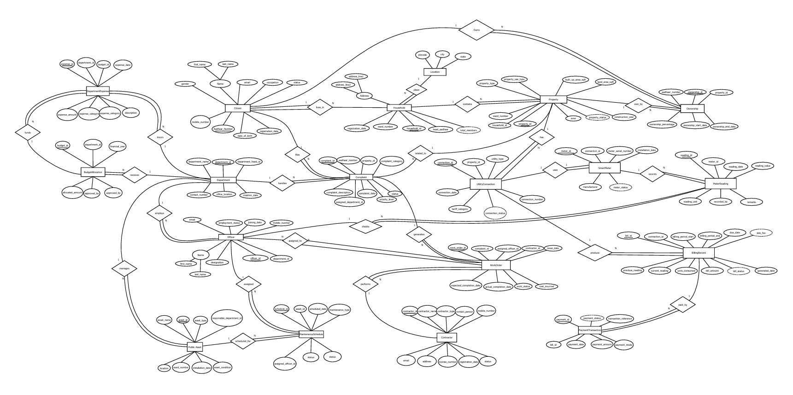
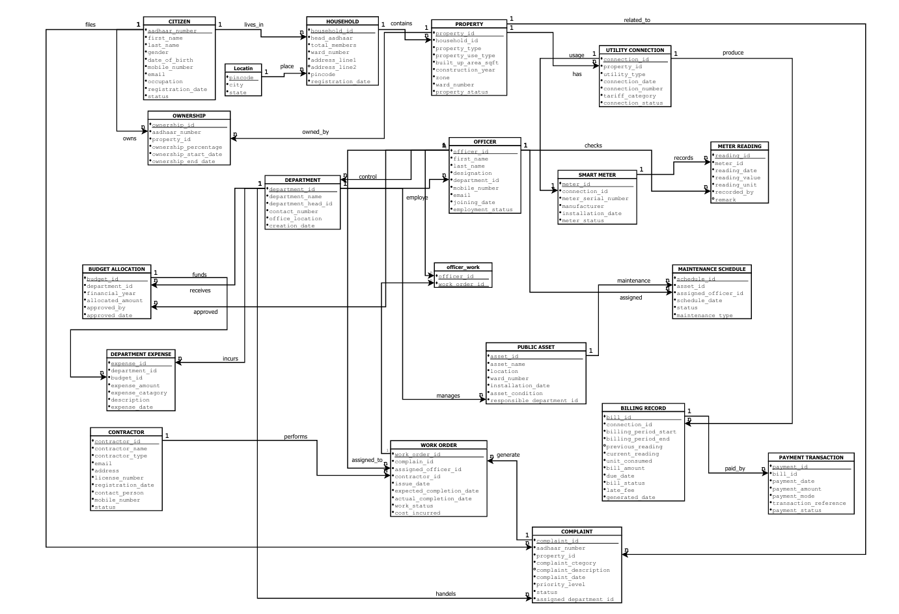

# 🏙️ City Complaint Management System

> A SQL-based Database Management System (DBMS) project designed to streamline the process of managing citizen complaints, department assignments, work orders, and complaint resolution for a smart city administration.

---

## 📖 Project Overview

The **City Complaint Management System** is a relational database project developed using **SQL** and **MySQL** to efficiently manage complaints raised by citizens. It provides a structured workflow where complaints are assigned to the appropriate departments and officers, work orders are generated, and the complete resolution process is tracked.

This project demonstrates real-world database design concepts including normalization, relational modeling, constraints, and advanced SQL queries while solving a practical city governance problem.

---

## 🎯 Objectives

- 📝 Register and manage citizen complaints.
- 🏢 Organize departments and officers efficiently.
- 🔧 Generate and monitor work orders.
- 👷 Manage contractor assignments.
- 📊 Track complaint status and resolution.
- 📈 Generate meaningful reports using SQL queries.

---

## ✨ Key Features

- ✅ Citizen Complaint Registration
- ✅ Department & Officer Management
- ✅ Work Order Generation
- ✅ Contractor Management
- ✅ Complaint Status Tracking
- ✅ Relational Database Design
- ✅ Advanced SQL Query Execution
- ✅ Data Integrity using Constraints

---

## 🛠️ Technologies Used

| Technology | Purpose |
|------------|---------|
| 🗄️ MySQL | Database Management System |
| 💻 SQL | Database Query Language |
| 📐 ER Modeling | Database Design |
| 📚 DBMS Concepts | Normalization & Relationships |

---

## 🗂️ Project Structure

```text
City-Complaint-Management-System
│
├── 📂 Database
│   ├── DDL_Script.sql
│   ├── Inserted_Data.sql
│   └── Queries_and_Solutions.sql
│
├── 📂 Documentation
│   └── ERD_Schema.pdf
│
├── 📂 Images
│   ├── ERD.png
│   ├── Schema.png
│   └── Output.png
│
└── 📄 README.md
```

---

## 🖼️ Database Design

### 📌 Entity Relationship Diagram (ERD)

<p align="center">

</p>

---

### 📌 Relational Schema

<p align="center">

</p>

---

## 🗃️ Database Entities

The database consists of the following entities:

- 👤 Citizen
- 📢 Complaint
- 🏢 Department
- 👮 Officer
- 📋 Work Order
- 👷 Contractor
- 🏠 Property

These entities are connected using **Primary Keys** and **Foreign Keys** to maintain data consistency and integrity.

---

## 📂 Project Files

| File | Description |
|------|-------------|
| 📄 DDL_Script.sql | Database creation script |
| 📄 Inserted_Data.sql | Sample records for all tables |
| 📄 Queries_and_Solutions.sql | SQL queries with solutions |
| 📄 ERD_Schema.pdf | ER Diagram and Relational Schema |

---

## 🧠 SQL Concepts Demonstrated

This project showcases various SQL and DBMS concepts, including:

- CREATE TABLE
- ALTER TABLE
- PRIMARY KEY
- FOREIGN KEY
- CHECK Constraints
- INSERT
- UPDATE
- DELETE
- INNER JOIN
- LEFT JOIN
- RIGHT JOIN
- GROUP BY
- HAVING
- ORDER BY
- Aggregate Functions
- Nested Queries
- Subqueries
- Data Normalization
- Referential Integrity

---

## 📊 Learning Outcomes

Through this project, I gained practical experience in:

- ✔️ Designing real-world relational databases.
- ✔️ Creating ER diagrams and relational schemas.
- ✔️ Applying database normalization techniques.
- ✔️ Writing optimized SQL queries.
- ✔️ Managing relationships using constraints.
- ✔️ Solving practical database problems using SQL.

---

## 🚀 Future Improvements

Some features that can be added in future versions include:

- 🌐 Web-based user interface
- 🔐 User Authentication & Role Management
- 📍 GIS-based complaint location tracking
- 📱 Mobile Application Integration
- 📈 Interactive Dashboard & Analytics
- 📧 Email/SMS notifications
- ☁️ Cloud Database Deployment

---

## 👨‍💻 Author

**Darshil Kanani**

- 🎓 B.Tech Computer Engineering Student
- 💻 Passionate about Software Development, Databases, and Competitive Programming

---

## ⭐ Support

If you found this project useful, consider giving it a **⭐ Star** on GitHub. It motivates me to build more useful projects!

---

**Thank you for visiting this repository! 🚀**
